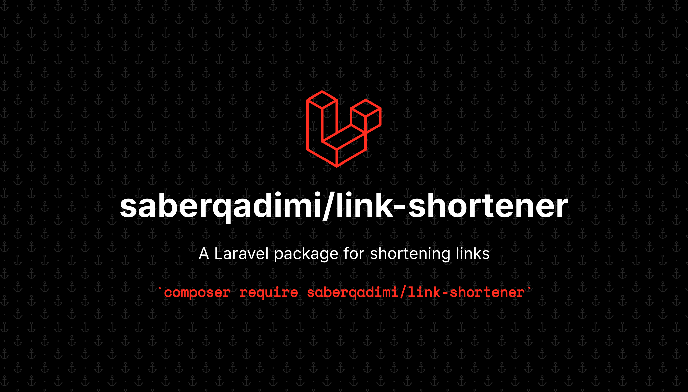

# Laravel Link Shortener



A Laravel package for shortening URLs with analytics support. 🚀

## 📥 Installation

You can install this package via Composer:

```bash
composer require saberqadimi/link-shortener
```

## ⚙️ Configuration

### 1️⃣ Publish the Service Provider
After installation, publish the package's service provider:

```bash
php artisan vendor:publish --provider="Laravel\LinkShortener\LinkShortenerServiceProvider"
```

### 2️⃣ Publish Assets (CSS & JS)
To use the front-end assets, run:

```bash
php artisan vendor:publish --tag=laravel/link-shortener
```

### 3️⃣ Run Migrations
The package comes with necessary database migrations. Run:

```bash
php artisan migrate
```

## 🚀 Usage

Once installed and configured, you can access the link shortener page at:

```
https://your-domain.com/link/shorten
```

⚠️ **Note:** The user must be logged in to access this page.

## 📄 License
This package is open-source and available under the MIT License.

---

### **💡 Quick Commands:**
1️⃣ **Install Package** → `composer require saberqadimi/link-shortener`  
2️⃣ **Publish Service Provider** → `php artisan vendor:publish --provider="Laravel\LinkShortener\LinkShortenerServiceProvider"`  
3️⃣ **Publish Assets** → `php artisan vendor:publish --tag=laravel/link-shortener`  
4️⃣ **Run Migrations** → `php artisan migrate`  
5️⃣ **Access Shortener Page** → `/link/shorten` (User must be logged in)  

